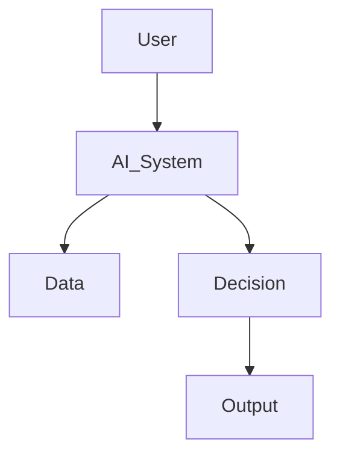
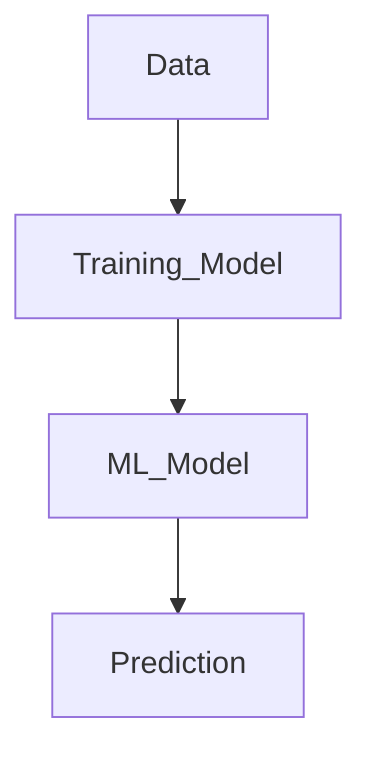
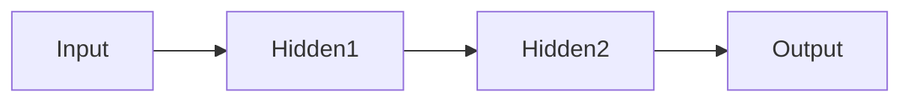
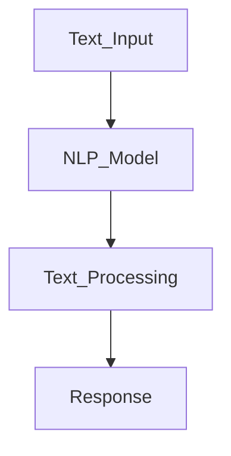
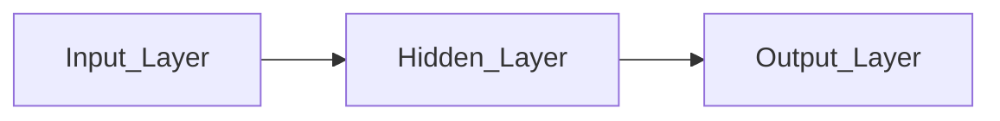
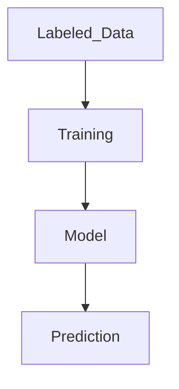
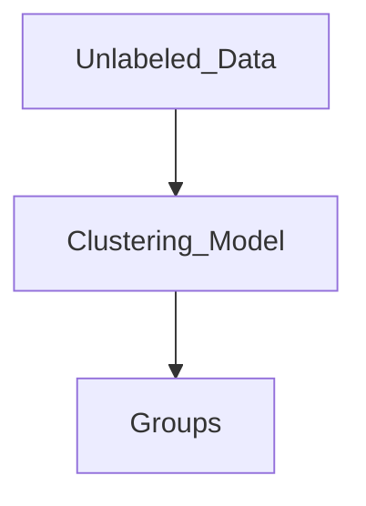
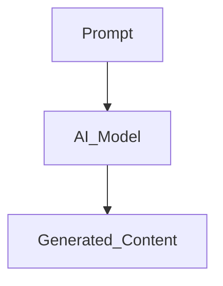
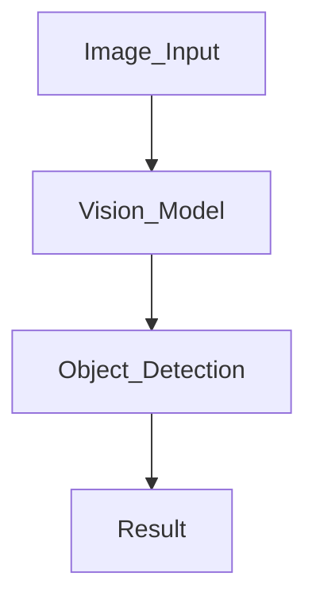
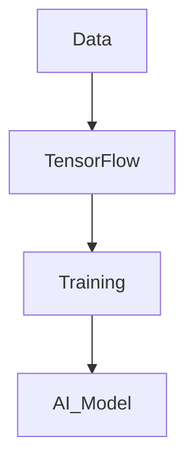

# Artificial Intelligence (AI)

## What is Artificial Intelligence?
Level: Beginner  

### Answer
- Artificial Intelligence (AI) is the simulation of human intelligence by machines.
- AI systems can learn, reason, solve problems, and make decisions.
- AI is used in chatbots, recommendation systems, robotics, and automation.

### Architecture Diagram


### Python Code
```python
print("Welcome to Artificial Intelligence")
```

---

## What is Machine Learning?
Level: Beginner  

### Answer
- Machine Learning is a subset of AI.
- It allows systems to learn from data without explicit programming.
- Models improve performance based on training data.

### Architecture Diagram


### Python Code
```python
from sklearn.linear_model import LinearRegression

model = LinearRegression()

print("Machine Learning Model Created")
```

---

## What is Deep Learning?
Level: Intermediate  

### Answer
- Deep Learning is a subset of Machine Learning.
- It uses neural networks with multiple layers.
- It is useful for image recognition and NLP.

### Architecture Diagram


### Python Code
```python
import tensorflow as tf

model = tf.keras.Sequential()

print("Deep Learning Model Initialized")
```

---

## What is Natural Language Processing (NLP)?
Level: Beginner  

### Answer
- NLP enables computers to understand human language.
- It is used in chatbots, translation apps, and voice assistants.
- NLP combines AI and Machine Learning.

### Architecture Diagram


### Python Code
```python
text = "Artificial Intelligence is amazing"

words = text.split()

print(words)
```

---

## What are Neural Networks?
Level: Intermediate  

### Answer
- Neural networks are inspired by the human brain.
- They consist of interconnected neurons.
- They are the foundation of Deep Learning.

### Architecture Diagram


### Python Code
```python
from tensorflow.keras.models import Sequential
from tensorflow.keras.layers import Dense

model = Sequential([
    Dense(10, activation='relu'),
    Dense(1)
])

print("Neural Network Created")
```

---

## What is supervised learning?
Level: Beginner  

### Answer
- Supervised learning uses labeled data.
- The model learns input-output relationships.
- It is used for prediction and classification.

### Architecture Diagram


### Python Code
```python
X = [1, 2, 3, 4]
y = [2, 4, 6, 8]

print("Training data prepared")
```

---

## What is unsupervised learning?
Level: Beginner  

### Answer
- Unsupervised learning works with unlabeled data.
- The model identifies hidden patterns.
- Clustering is a common example.

### Architecture Diagram


### Python Code
```python
from sklearn.cluster import KMeans

data = [[1], [2], [3], [10], [11]]

model = KMeans(n_clusters=2)

print("Unsupervised Learning Example")
```

---

## What is Generative AI?
Level: Intermediate  

### Answer
- Generative AI creates text, images, audio, and code.
- It learns patterns from large datasets.
- LLMs are widely used in Generative AI.

### Architecture Diagram


### Python Code
```python
prompt = "Write a poem about AI"

print(f"Generating response for: {prompt}")
```

---

## What is Computer Vision?
Level: Beginner  

### Answer
- Computer Vision enables machines to understand images and videos.
- It is used in facial recognition and self-driving cars.
- AI models analyze visual data.

### Architecture Diagram


### Python Code
```python
import cv2

print("Computer Vision with OpenCV")
```

---

## What is TensorFlow?
Level: Intermediate  

### Answer
- TensorFlow is an open-source AI framework.
- It helps build and train neural networks.
- It is widely used in Deep Learning.

### Architecture Diagram


### Python Code
```python
import tensorflow as tf

print(tf.__version__)
```
