# AWS Interview Points
> (c) venkata Bhattaram | TINITIATE.COM

* Consolidated talking points for Interview Prep


## AWS S3
| Service | Logo |
| --- | --- |
| Amazon S3 |  |

---

### S3 Core Storage

* Core storage concepts: how S3 works as object storage, where data lives, and how it scales

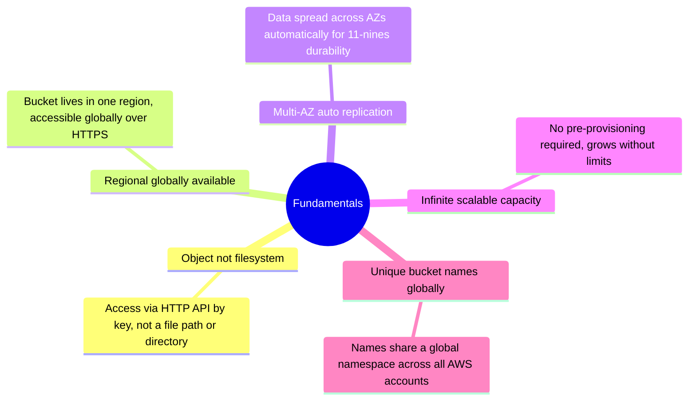

* Anatomy of an S3 object: its key, value, metadata, version ID, and subresources

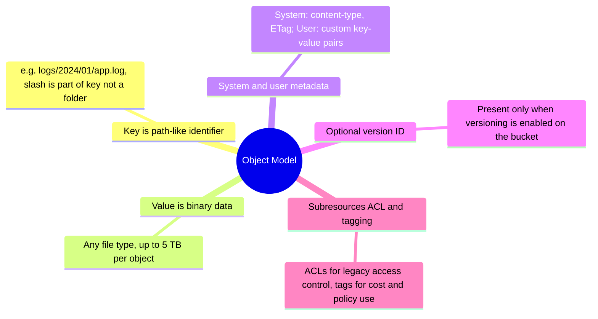

* Hard and soft limits to know: object size, upload size, bucket count, and per-prefix request rates

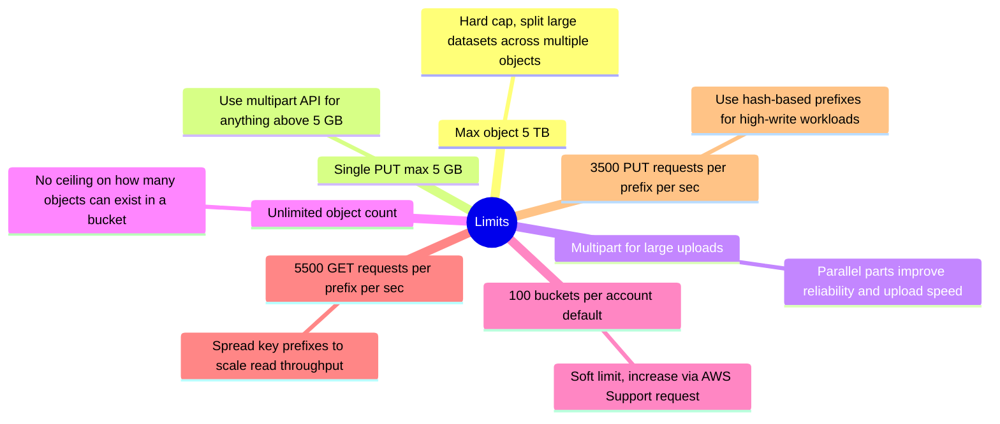

* Read-after-write consistency model for all S3 operations since December 2020

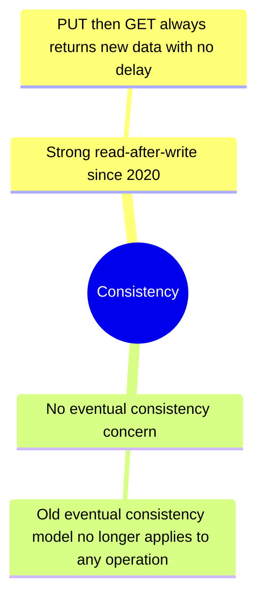

**Key Points**
* Object storage — not a file system; access is by key via HTTP/HTTPS API, not file path
* Bucket names must be globally unique across all AWS accounts
* Multi-AZ durability is 11 nines (99.999999999%) — built-in, no configuration needed
* Max object size is 5 TB; single PUT is limited to 5 GB — use multipart for anything larger
* Request rate limits are per prefix: spread data across prefixes to increase aggregate throughput
* S3 has strong read-after-write consistency for all operations since December 2020

**QnA**
* What is Amazon S3? — Object storage service for files, backups, logs, media, and data lakes
* How does S3 handle durability? — Automatic multi-AZ replication gives 11 nines durability; no action needed
* What are the key request rate limits? — 5500 GET and 3500 PUT per prefix per second; add prefixes for more throughput
* What limits matter most in interviews? — 5 TB max object, 5 GB single PUT, 100 buckets default, 11 nines durability
* Is S3 strongly consistent? — Yes, since December 2020 all S3 operations have strong read-after-write consistency

---

### S3 Storage Classes

* Standard and Intelligent-Tiering: classes for frequently accessed data with no retrieval fees

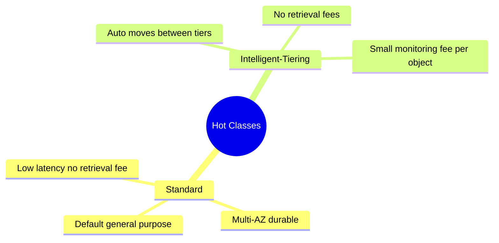

* Standard-IA and One Zone-IA: lower-cost classes for infrequent access with retrieval fees and minimum durations

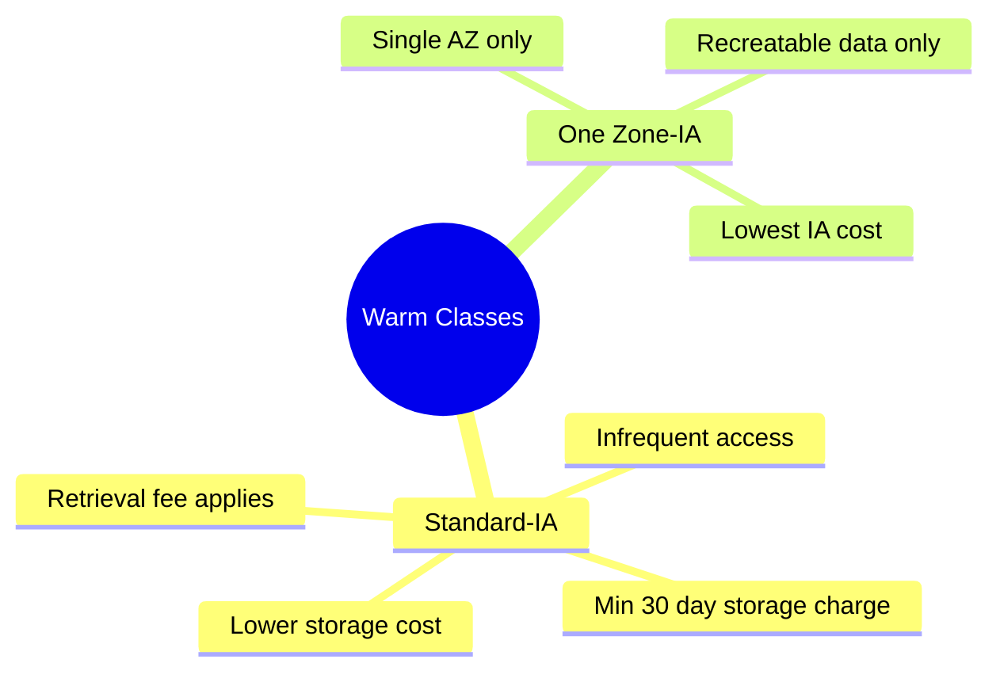

* Glacier tiers: archive storage with retrieval times from milliseconds to 48 hours and minimum storage durations

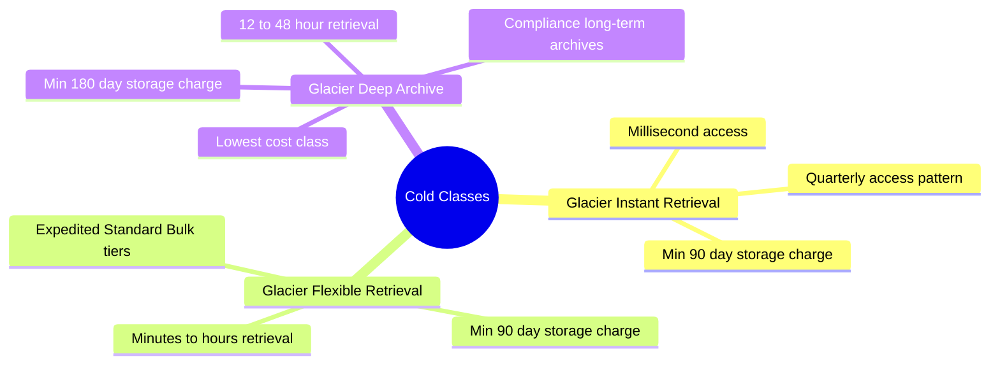

**Key Points**
* Standard is default — multi-AZ, low latency, no retrieval fees; best for frequently accessed data
* Intelligent-Tiering auto-moves objects between access tiers; no retrieval fees but has small per-object monitoring fee
* Standard-IA and One Zone-IA both charge retrieval fees; 30-day minimum storage duration applies
* One Zone-IA stores in a single AZ — only for data that can be recreated; never for backups
* Glacier Instant gives millisecond retrieval; Flexible is minutes to hours; Deep Archive is 12–48 hours
* Minimum storage durations: IA=30d, Glacier Instant/Flexible=90d, Deep Archive=180d — early deletion still charged
* Lifecycle policies automate transitions between storage classes based on age rules

**QnA**
* When use Standard-IA vs Glacier? — IA for occasional access needing quick retrieval; Glacier for archives rarely needed
* What is Intelligent-Tiering? — Auto-tiering class that moves objects based on actual access patterns without retrieval fees
* What is the cheapest S3 class? — Glacier Deep Archive; suits compliance archives with 12–48 hr retrieval SLA
* Gotcha for One Zone-IA? — Single AZ means data loss if AZ fails; only for regeneratable or replicated data

---

### S3 Versioning

* The three versioning states a bucket can be in: unversioned, enabled, or suspended

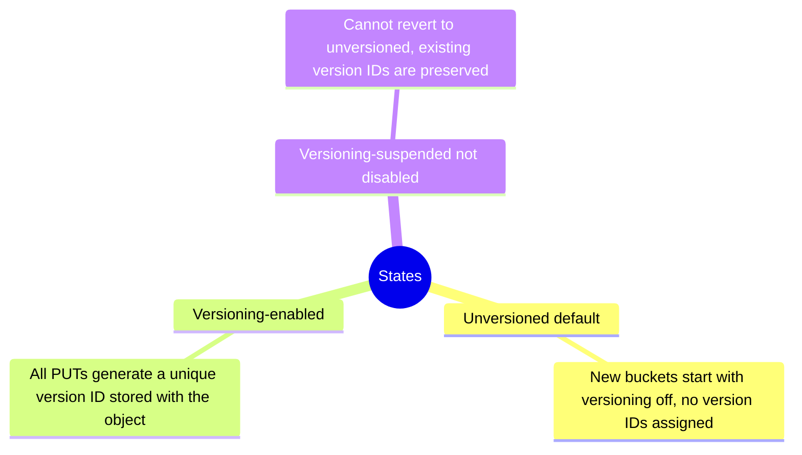

* How PUT, GET, and DELETE operations behave differently when versioning is enabled on the bucket

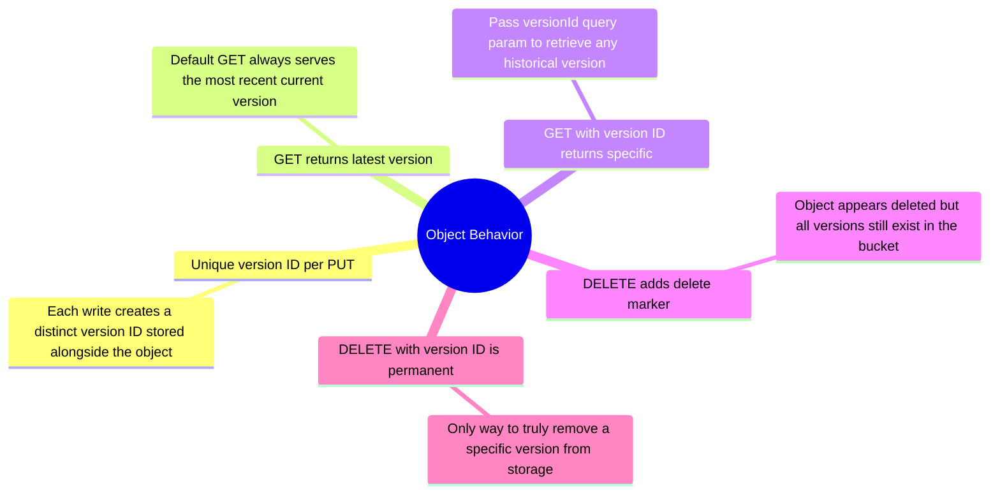

* How versioning protects against accidental deletes, supports compliance, and enables object history

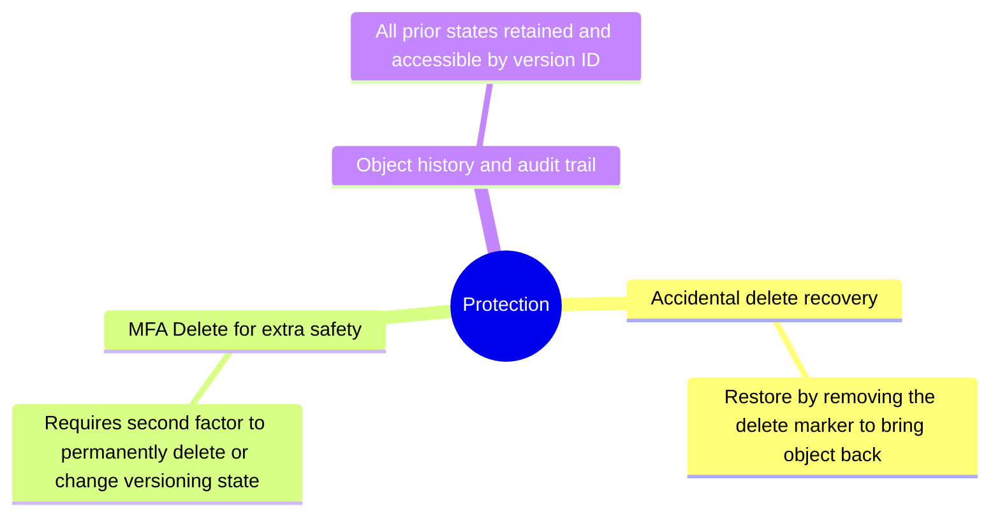

* Storage billing impact of versioning and lifecycle rules to control version accumulation cost

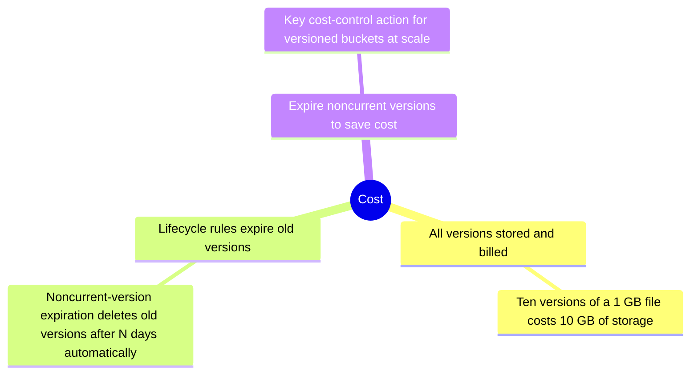

* AWS features that require versioning to be enabled before they can be configured

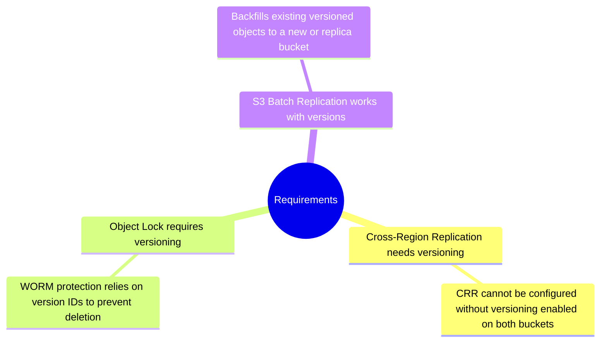

**Key Points**
* Versioning must be explicitly enabled; once enabled it can only be suspended, never fully disabled
* Every PUT creates a new version with a unique version ID; GET without version ID returns the current version
* DELETE without version ID adds a delete marker — the object appears deleted but all versions still exist in S3
* DELETE with a specific version ID permanently removes that version — this is the only true permanent delete
* MFA Delete requires MFA authentication to permanently delete versions or change versioning state — extra compliance protection
* Versioning is a prerequisite for Cross-Region Replication and Object Lock
* All versions count toward storage billing; use lifecycle noncurrent-version expiration rules to control cost

**QnA**
* Can you disable versioning once enabled? — No, only suspend; all existing version IDs are preserved
* How does delete work with versioning? — DELETE adds a delete marker; GET returns 404 but data is still there with old version IDs
* How do you permanently delete a versioned object? — DELETE with the specific version ID removes that version permanently
* Why enable MFA Delete? — Prevents accidental or malicious permanent deletion without a second authentication factor

---

### S3 Lifecycle Policies

* Rules that automatically move objects to cheaper storage classes based on object age

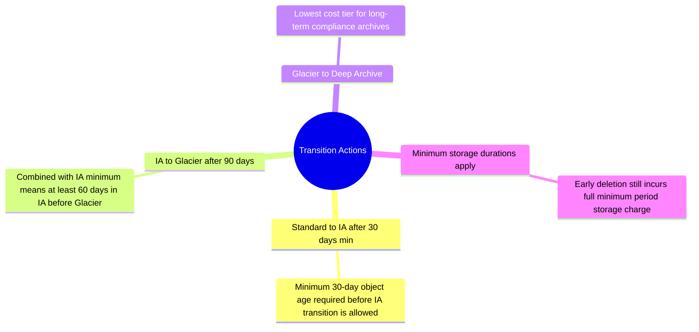

* Rules that automatically delete objects, versions, incomplete uploads, and delete markers

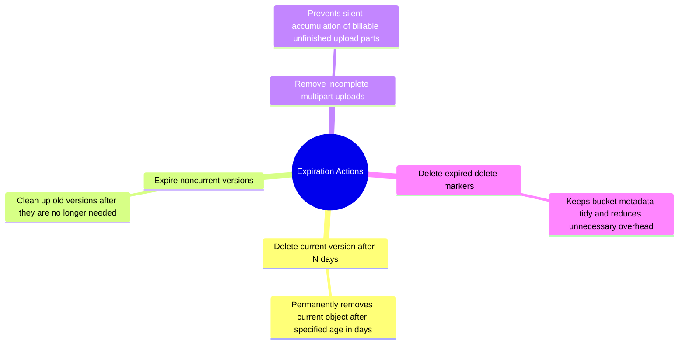

* How to scope lifecycle rules to specific objects using bucket-wide, prefix, tag, or size filters

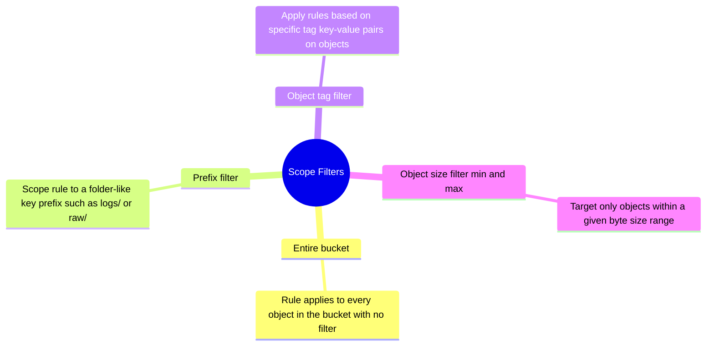

* Common lifecycle patterns that directly reduce S3 storage and operational costs over time

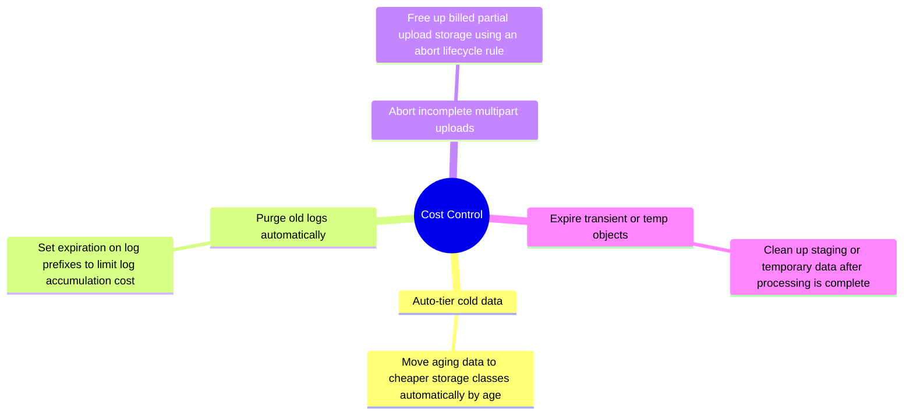

**Key Points**
* Lifecycle rules have two action types: transition (move to cheaper class) and expiration (delete objects)
* Minimum storage durations still apply during transitions: IA=30d, Glacier=90d, Deep Archive=180d
* Scope rules to entire bucket or filter by prefix, object tag, or object size range
* Always add a rule to abort incomplete multipart uploads — they accumulate silently and are billed
* Expire noncurrent versions with a noncurrent-version expiration rule to control versioning storage cost
* Delete expired delete markers automatically to keep bucket metadata clean

**QnA**
* What is a lifecycle policy? — Rules that automatically transition or delete S3 objects based on age or version state
* How do you reduce S3 storage cost over time? — Lifecycle transitions to IA or Glacier, expiration rules, expire old versions
* What is commonly forgotten in lifecycle setup? — Aborting incomplete multipart uploads; they silently accumulate and add cost

---

### S3 Security and Encryption

* Server-side encryption options: AWS-managed key, customer KMS key, or customer-provided key

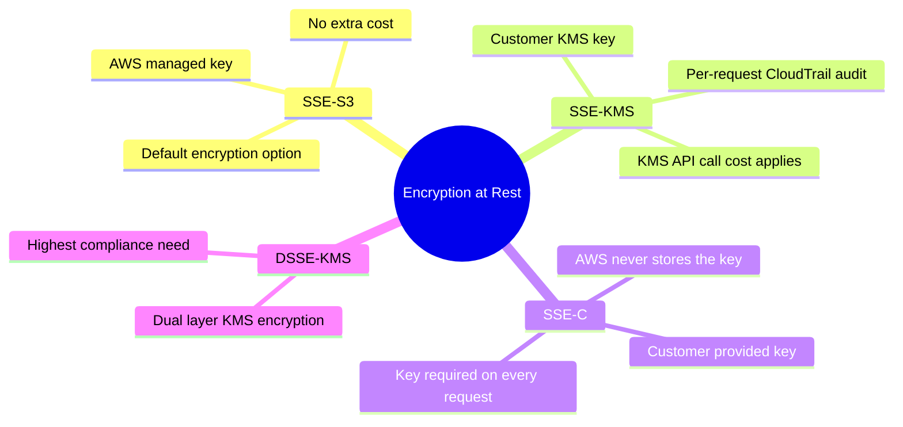

* Enforcing HTTPS for all S3 requests using a bucket policy with the SecureTransport condition

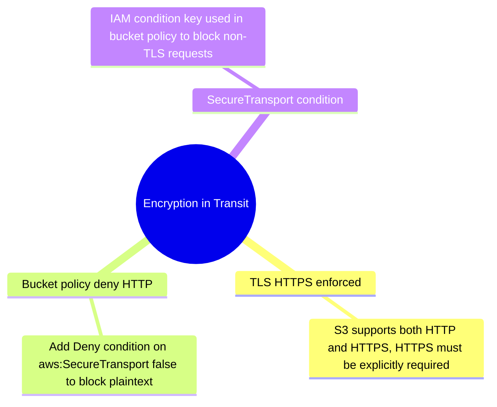

* Layers of access control: IAM policies, bucket policies, Block Public Access, access points, and ACLs

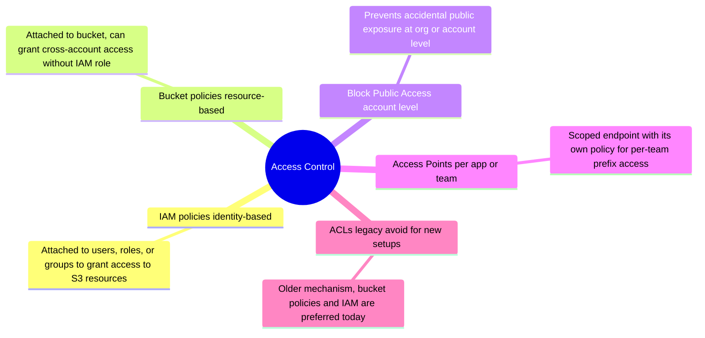

* Advanced security features: VPC endpoints, presigned URLs, Object Lock WORM, and Macie scanning

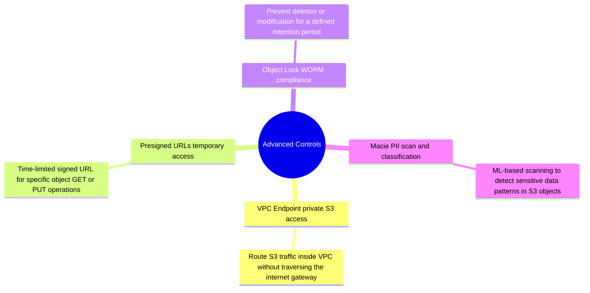

* Observability tools for auditing who accessed S3, what they did, and when

```mermaid
mindmap
  root((Audit))
    CloudTrail API call log
      Logs every API operation with caller identity, time, and parameters
    S3 Server Access Logs request log
      Per-request HTTP log for access pattern analysis and debugging
    CloudWatch metrics and alarms
      Track error rates, latency, and bucket size trends with alarms
```

**Key Points**
* SSE-S3: AWS manages the key; no extra cost; simplest to enable; good default for most workloads
* SSE-KMS: customer controls the key via KMS; adds per-request audit trail in CloudTrail; KMS API costs apply at scale
* SSE-C: customer provides the key on every request; AWS never stores the key; highest customer control
* Use a bucket policy `Deny` on `aws:SecureTransport: false` to enforce HTTPS on all requests
* Block Public Access should be on at account level; only disable per bucket when explicitly hosting public content
* Access Points give each team or application its own named endpoint with its own access policy scoped to a prefix

**QnA**
* Difference between SSE-S3 and SSE-KMS? — SSE-S3 is simpler; SSE-KMS adds key control, audit trail per request, and KMS pricing
* How do you force HTTPS on S3? — Bucket policy with Deny when `aws:SecureTransport` condition is false
* What is an S3 Access Point? — Named endpoint with its own access policy scoped to specific prefixes or applications
* What is Object Lock? — WORM protection that prevents deletion or overwrite for a defined retention period; requires versioning

---

### S3 Replication

* CRR vs SRR: when to replicate across regions vs within the same region, and the use cases for each

```mermaid
mindmap
  root((Replication Types))
    Cross-Region Replication CRR
      DR across regions
      Compliance data residency
      Latency reduction for global users
    Same-Region Replication SRR
      Log aggregation to central bucket
      Dev test copy from prod
      Data sovereignty same region
```

* Prerequisites that must be in place on both buckets before replication can be configured

```mermaid
mindmap
  root((Requirements))
    Versioning on source and destination
      Must enable versioning on both buckets before replication works
    IAM replication role
      S3 uses this role to read source objects and write to destination
    Encryption settings aligned
      SSE-KMS keys must be accessible across accounts when encryption used
```

* How replication handles new objects, existing objects, metadata, delete markers, and permanent deletes

```mermaid
mindmap
  root((Behavior))
    New objects only by default
      Replication applies only to objects written after rule is configured
    Existing objects need Batch Replication
      Separate Batch Replication job required to backfill pre-existing objects
    Metadata replicated with object
      System and user metadata are copied alongside the object data
    Delete markers optional config
      Not replicated unless explicitly enabled in the replication rule
    Permanent version deletes not replicated
      Provides compliance separation between source and destination buckets
```

* Advanced replication options: RTC SLA guarantee, bidirectional sync, and multi-destination configurations

```mermaid
mindmap
  root((Advanced))
    Replication Time Control RTC
      15 minute SLA guarantee
        Guaranteed replication within 15 minutes with CloudWatch evidence
      CloudWatch metrics for compliance
        Metrics track replication lag and SLA adherence for audits
    Bidirectional replication two-way
      Both buckets serve as source and destination for active-active patterns
    Multi-destination to many buckets
      One source bucket can replicate objects to multiple target buckets
```

**Key Points**
* CRR replicates to a different region for DR or compliance; SRR replicates within the same region for aggregation or dev/test
* Versioning must be enabled on both source and destination buckets before replication can start
* Replication is asynchronous and only applies to new objects written after replication is configured
* Pre-existing objects require a separate S3 Batch Replication job — replication rules do not backfill automatically
* Delete markers are not replicated by default — configure explicitly if downstream bucket must mirror deletes
* Permanent deletes (DELETE with version ID) are never replicated — important for compliance separation
* Replication Time Control (RTC) provides a 15-minute SLA with CloudWatch metrics for SLA evidence

**QnA**
* Difference between CRR and SRR? — CRR crosses regions for DR; SRR stays in region for aggregation or dev/test copies
* Does replication backfill existing objects? — No; use S3 Batch Replication to copy pre-existing objects
* Are deletes replicated? — Delete markers are optional; permanent version deletes are never replicated

---

### S3 as Data Lake

* The three-zone data lake pattern: raw landing, curated transform, and consumption serving layers

```mermaid
mindmap
  root((Architecture Zones))
    Raw landing zone
      Unprocessed source-format data ingested without transformation
    Curated transform zone
      Cleaned, columnar, partitioned data ready for analytics queries
    Consumption serving zone
      Optimized tables exposed to Athena, Redshift, or BI tools
```

* File format choices for each data lake layer and their tradeoffs for analytics query cost and speed

```mermaid
mindmap
  root((File Formats))
    Parquet columnar analytical
      Column pruning reduces Athena scan cost, best for analytics queries
    ORC columnar Hive compatible
      Similar to Parquet, preferred in Hive and Pig workloads
    Avro row format streaming events
      Row-based, efficient for serialization and schema evolution in streams
    JSON semi-structured raw ingestion
      Easy to produce but expensive to query at scale without conversion
    CSV simple flat file interchange
      Widest compatibility but no compression or schema enforcement built in
```

* AWS services that query data directly from S3 in a data lake architecture and their roles

```mermaid
mindmap
  root((Query Layer))
    Athena serverless SQL
      Pay per scan, no cluster management, ideal for ad hoc queries
    Glue Spark ETL and catalog
      Managed Spark for transformation and shared metadata catalog
    EMR big data Spark Flink
      Customizable cluster for heavy Spark, Flink, or Presto workloads
    Redshift Spectrum external tables
      Query S3 data from Redshift using external table definitions
    Lake Formation governance layer
      Fine-grained column and row access control over Glue Catalog and S3
```

* Lakehouse table formats that add ACID, snapshots, and schema evolution on top of S3 files

```mermaid
mindmap
  root((Open Table Formats))
    Apache Iceberg ACID lakehouse
      Snapshot-based ACID writes with schema and partition evolution support
    Apache Hudi CDC upserts
      Strong for CDC ingestion and record-level update and delete patterns
    Delta Lake Spark native
      Developed by Databricks with similar lakehouse semantics to Iceberg
```

* How to partition S3 data for efficient query pruning and what happens when partitioning goes too far

```mermaid
mindmap
  root((Partitioning))
    Year month day partition keys
      Date-based partitions align with most common filter patterns
    Hive-style partition paths
      Key format year=2024/month=01 for broad query engine compatibility
    Partition pruning reduces scan cost
      Query engines skip non-matching partitions to reduce data scanned
    Over-partitioning hurts performance
      Too many partitions create metadata overhead and small-file issues
```

* Why many tiny files degrade analytics performance and how compaction and file sizing solve it

```mermaid
mindmap
  root((Small File Problem))
    Many tiny files hurt query planning
      Each file adds metadata overhead that slows query engine planning
    Compaction merges small files
      Periodic job rewrites many small files into fewer larger ones
    Iceberg manages compaction
      Built-in compaction action optimizes file layout without manual steps
    Target 128 MB to 1 GB file size
      Sweet spot for columnar query performance in analytics workloads
```

**Key Points**
* Pattern: Raw zone (S3) → Curated zone (Parquet/Iceberg) → Consumption zone (Athena, Redshift)
* Always use columnar formats (Parquet/ORC) in curated layers — critical for Athena scan cost and query speed
* Partition by date or common filter columns so query engines prune scan scope and skip irrelevant files
* Small file problem: millions of tiny files increase metadata overhead and slow query planning — compact regularly
* Use Iceberg or Hudi on curated tables when ACID, upserts, deletes, or time travel are required
* Lake Formation adds fine-grained column-level and row-level access governance on top of S3 and Glue Catalog

**S3 Tables (Iceberg)**
* Lakehouse-style tabular datasets in Apache Iceberg format — fully managed
* Managed compaction and snapshot maintenance — no manual file management needed
* Glue Catalog integration — Athena, Redshift, and Spark can discover and query tables
* Use S3 Tables for curated analytical Iceberg tables; plain S3 prefixes for raw landing zones

**QnA**
* What makes S3 a data lake? — Unlimited scale, any format, query-in-place with Athena/Glue/EMR, open table format support
* What is the small-file problem? — Too many tiny files in S3 create metadata overhead for query engines; compact into larger files
* How do you partition a data lake in S3? — Use Hive-style prefix paths like year=2024/month=01/day=15 for partition pruning
* When use Iceberg vs plain Parquet? — Use Iceberg when you need updates, deletes, time travel, schema evolution, or ACID guarantees

---

### S3 and EventBridge

* S3 event types that EventBridge receives and can route to downstream targets for automation

```mermaid
mindmap
  root((Event Types))
    ObjectCreated
      Fires on PUT, POST, COPY, or completed multipart upload
    ObjectDeleted
      Fires when a delete or delete marker is created on an object
    ObjectRestore
      Fires when a Glacier restore is initiated or completed
    ReplicationFailure
      Fires when replication cannot copy an object to the destination
    ObjectTaggingAdded
      Fires when tags are added to an object
    LifecycleTransition
      Fires when a lifecycle rule moves an object to a new storage class
```

* AWS services EventBridge can deliver S3 events to, enabling event-driven architectures

```mermaid
mindmap
  root((Routing Targets))
    Lambda function
      Run serverless code on S3 events without managing servers
    Step Functions
      Trigger multi-step orchestration workflows on file arrival
    SQS queue
      Buffer events for decoupled async processing with built-in retries
    SNS topic
      Fan out notifications to multiple subscribers simultaneously
    Kinesis Data Stream
      Stream events into real-time processing pipelines
    API Gateway
      Invoke REST endpoints or webhooks in response to S3 events
    ECS task
      Trigger containerized processing jobs for heavier workloads
```

* Why EventBridge is more powerful than native S3 notifications: richer filtering, fan-out, and replay

```mermaid
mindmap
  root((Advantages over Native))
    Richer filtering rules
      Match on prefix, suffix, object size, and metadata conditions
    Multiple targets per rule
      One event triggers Lambda, SQS, and Step Functions simultaneously
    Archive and replay events
      Store S3 events and replay them for debugging or reprocessing
    Schema registry integration
      Discover and validate event shape automatically with EventBridge registry
    Cross-account event delivery
      Route S3 events to another AWS account event bus directly
    Dead-letter queue support
      Capture undeliverable events for investigation and retry
```

* Real-world EventBridge patterns for reacting to file arrivals, deletes, restores, and tag changes

```mermaid
mindmap
  root((Common Patterns))
    File lands trigger Glue or Step Functions
      Most common event-driven pipeline trigger on new S3 file arrival
    Delete triggers audit log entry
      Record deletion events in a compliance or audit log automatically
    Restore complete triggers notification
      Alert users or systems when a Glacier restore is ready to use
    Tag change triggers downstream workflow
      Drive classification or governance automation on object tag changes
```

**Key Points**
* Enable EventBridge on a bucket to send all S3 events to the default event bus
* EventBridge offers richer filtering (prefix, suffix, object metadata conditions) compared to native S3 notifications
* One S3 event can route to multiple EventBridge rules targeting different services simultaneously
* Archive and replay: EventBridge archives S3 events so you can replay them for debugging or reprocessing
* Use EventBridge over native S3 notifications when you need multiple targets, cross-account routing, or event archiving
* Common pattern: new file in S3 → EventBridge rule → Lambda triggers Glue job or Step Functions execution

**QnA**
* Why use EventBridge instead of native S3 notifications? — Multiple targets, advanced filtering, event archive and replay, cross-account delivery
* Can one S3 upload trigger multiple downstream services? — Yes; EventBridge rules can route one event to Lambda, SQS, Step Functions simultaneously
* What event types does S3 send to EventBridge? — Created, Deleted, Restore, Replication failure, Tagging, Lifecycle transition

---

### S3 Event Notifications
* Event Notifications - Native Destinations
* The three native S3 notification destinations — SQS, SNS, Lambda — plus the EventBridge option

```mermaid
mindmap
  root((Native Destinations))
    SQS queue
      Durable queue that decouples S3 events from downstream consumers
    SNS topic
      Broadcast S3 events to email, SMS, Lambda, and SQS subscribers
    Lambda function
      Process S3 events directly in serverless compute without a queue
    EventBridge all events option
      Enable to send all S3 events to the default account event bus
```

* Categories of S3 events and the specific operations that trigger each notification type

```mermaid
mindmap
  root((Event Categories))
    ObjectCreated
      PUT POST COPY
      CompleteMultipartUpload
    ObjectRemoved
      Delete versioned
      DeleteMarkerCreated
    ObjectRestore
    Replication events
    LifecycleTransition
```

* How to scope native S3 notifications to specific object keys using prefix and suffix filters

```mermaid
mindmap
  root((Filtering Options))
    Prefix filter key prefix
      Match objects whose key starts with a given string such as logs/
    Suffix filter file extension
      Match objects whose key ends with .csv, .json, or .parquet
```

* Constraints of native S3 notifications compared to EventBridge: no fan-out, no replay, limited filtering

```mermaid
mindmap
  root((Limitations))
    No metadata or tag filtering
      Cannot filter on object size, tags, or custom metadata values
    Single destination per rule
      Each event configuration can target only one SQS, SNS, or Lambda
    At-least-once delivery
      Consumers must handle duplicate events using idempotent processing
    No guaranteed order
      Events may arrive out of sequence relative to upload order
    No replay or archive
      Lost events cannot be recovered, use EventBridge for event durability
```

**Key Points**
* Native S3 notifications support SQS, SNS, and Lambda; enable EventBridge for richer routing
* Filtering is limited to object key prefix and suffix — no metadata, tag, or size-based filtering
* Each event configuration rule can point to only one destination — use EventBridge for fan-out
* At-least-once delivery means Lambda handlers and consumers must be idempotent to handle duplicate events
* Common pattern: S3 → SQS → Lambda polling — decouples traffic spikes and adds retry with DLQ support
* For richer filtering, multiple targets, or event replay, enable EventBridge at the bucket level

**QnA**
* What are native S3 event destinations? — SQS, SNS, Lambda, and EventBridge (when enabled on the bucket)
* Limitation of S3 native event filtering? — Only prefix and suffix; no metadata, content, or tag filtering
* Why put SQS between S3 and Lambda? — Buffers traffic spikes, enables retry logic, and supports DLQ for failures

---

### S3 Performance and Optimization

* How per-prefix rate limits work and key strategies to spread load and increase aggregate throughput

```mermaid
mindmap
  root((Request Throughput))
    Multiple prefixes increase rate
      Each unique prefix gets its own independent rate ceiling
    5500 GET per prefix per second
      Spread key prefixes to scale read throughput across many prefixes
    3500 PUT per prefix per second
      Use random or hash-based prefixes for high-write ingestion workloads
    Avoid sequential timestamp prefixes
      Timestamps create a single hot prefix that hits the rate ceiling fast
```

* Techniques to speed up and improve reliability of large object uploads: multipart and Transfer Acceleration

```mermaid
mindmap
  root((Upload Optimization))
    Multipart upload parallel parts
      Break large files into chunks and upload parts in parallel threads
    Use for objects above 100 MB
      Required above 5 GB and strongly recommended above 100 MB
    Parallel part uploads
      Multiple threads upload parts simultaneously for maximum throughput
    Transfer Acceleration
      CloudFront edge network
        Routes uploads through nearest CloudFront edge for faster global upload
      Best for long-distance uploads
        Most beneficial when source is geographically far from bucket region
```

* Techniques to reduce download cost and latency: parallel byte-range GETs and S3 Select pushdown

```mermaid
mindmap
  root((Download Optimization))
    Byte-range GET parallel reads
      Fetch different byte ranges simultaneously for faster large file downloads
    S3 Select server-side filter
      Push SQL filter into S3 to return only matching rows or columns
    Reduces bytes transferred
      Less data returned means lower transfer cost and reduced client latency
```

* File format and compression choices that directly improve analytics query performance and lower scan cost

```mermaid
mindmap
  root((Format Optimization))
    Columnar Parquet or ORC
      Query engines read only needed columns and skip irrelevant ones
    Snappy Gzip ZSTD compression
      Compress files to reduce storage cost and data transfer time
    Target 128 MB to 1 GB files
      Optimal size range for columnar query performance in analytics
    Avoid many small files
      Small files increase metadata overhead and slow query engine planning
```

* Using CloudFront to cache and serve S3 content at the edge, reducing latency and S3 request load

```mermaid
mindmap
  root((Content Delivery))
    CloudFront CDN for static assets
      Cache S3 objects at edge locations close to end users globally
    Caching at edge reduces S3 load
      Fewer direct S3 requests lowers cost and improves response time
```

**Key Points**
* S3 scales automatically but per-prefix limits apply: 5500 GET / 3500 PUT per prefix per second
* Spread key prefixes to avoid hot spots — avoid all objects under a single date-stamped prefix at scale
* Use multipart upload for objects larger than 100 MB — improves reliability and allows parallel part uploads
* S3 Transfer Acceleration routes uploads through CloudFront edge nodes — useful for users far from the bucket region
* S3 Select lets query engines filter data inside S3 before returning it, reducing transferred bytes and compute cost
* For analytics workloads, use Parquet/ORC with snappy compression and file sizes of 128 MB–1 GB

**QnA**
* How do you increase S3 throughput? — Use multiple key prefixes; each prefix gets 5500 GET and 3500 PUT per second
* What is S3 Transfer Acceleration? — Routes uploads through CloudFront edges for better global upload performance
* What is S3 Select? — Server-side SQL filtering of S3 objects (CSV, JSON, Parquet) to reduce data returned to client

---

### S3 Limitations

* Size and count limits that apply to S3 objects and buckets — critical numbers for interviews

```mermaid
mindmap
  root((Object Limits))
    Max object 5 TB
      Hard limit, split very large datasets across multiple objects
    Single PUT max 5 GB
      Must use multipart upload API for any object larger than 5 GB
    Max 100 buckets per account default
      Soft limit that can be increased via AWS Support request
    Soft limit increase via support
      Submit a service quota increase request through the AWS console
```

* Key ways S3 differs from a filesystem and why that matters for application and pipeline design

```mermaid
mindmap
  root((Not a Filesystem))
    No partial in-place update
      Every PUT replaces the entire object, no byte-level modification
    No atomic multi-object transactions
      Cannot update multiple objects as a single atomic operation
    No cheap directory rename
      Prefix rename requires copy then delete across all objects under it
    No POSIX semantics
      No file locking, no append writes, no symbolic links
    No locking primitives
      Must implement optimistic locking in application code when needed
```

* Throughput and latency ceilings to plan around when designing high-volume S3-based systems

```mermaid
mindmap
  root((Performance Limits))
    Per-prefix request rate ceiling
      5500 GET and 3500 PUT per prefix is a hard throughput ceiling
    Higher latency than block storage
      Milliseconds of HTTP overhead vs microseconds on EBS or NVMe
    Small files hurt analytics cost
      Many tiny files increase scan time and Athena per-query cost
```

* Common S3 billing surprises that accumulate silently without lifecycle rules or careful design

```mermaid
mindmap
  root((Cost Traps))
    All versions billed
      Each version of an object adds to total storage cost in the bucket
    Incomplete multiparts billed
      Partial uploads accumulate silently without an abort lifecycle rule
    Retrieval fees on IA and Glacier
      Per-GB fee applies each time an IA or Glacier object is read
    Data transfer egress charges
      Traffic from S3 to internet or cross-region incurs egress charges
    Cross-region replication egress
      Replication traffic across AWS regions incurs per-GB transfer fees
```

* Immutability constraints on bucket names, regions, and object keys that cannot be changed after creation

```mermaid
mindmap
  root((Operational Constraints))
    Bucket name immutable after creation
      Cannot rename a bucket, must recreate and migrate data to new name
    Bucket region immutable
      Cannot move a bucket to another AWS region after creation
    Object key rename requires copy-delete
      No server-side rename, must copy then delete the original key
    No server-side move or rename
      All rename operations require a full object copy by the caller
```

**Key Points**
* S3 is object storage — no partial in-place updates; PUT replaces the entire object every time
* No atomic multi-object transactions — you cannot update multiple objects as a single atomic operation
* Renaming a prefix requires copying all objects then deleting originals — very expensive at scale with millions of objects
* S3 now has strong read-after-write consistency for all operations — the historic eventual consistency concern no longer applies
* Billing traps: all versions count, incomplete multipart uploads accumulate silently, Glacier retrieval fees apply
* Egress costs: data transferred out to internet or cross-region is charged; within the same region is generally free
* Bucket names and regions cannot be changed after creation

**QnA**
* Can you rename an S3 folder? — Not natively; it requires copying all objects to the new prefix and deleting the originals
* What are common S3 cost surprises? — Versioning storage, incomplete multipart uploads, Glacier retrieval fees, egress charges
* Is S3 suitable for transactional workloads? — No; no partial updates, no multi-object atomicity, no locking primitives

---

### S3 Real-time and Batch Processing

* Patterns for processing S3 data in seconds or near-real-time immediately after file arrival

```mermaid
mindmap
  root((Real-time Patterns))
    S3 event triggers Lambda
      File arrival instantly invokes Lambda for per-file processing
    EventBridge rule to Step Functions
      Complex orchestration triggered automatically on S3 object events
    Kinesis Firehose buffered writes
      Streaming records aggregated and written to S3 at configured intervals
    Near real-time Hudi MoR ingestion
      Merge-on-Read writes fresh records without full partition rewrites
    Flink Structured Streaming to S3
      Continuous streaming writes into S3 from Apache Flink pipelines
```

* Patterns for scheduled bulk processing of large S3 datasets using Glue, EMR, Athena, and Airflow

```mermaid
mindmap
  root((Batch Patterns))
    Scheduled Glue ETL jobs
      Time-triggered Spark jobs that transform S3 data in bulk on a schedule
    Airflow DAGs orchestrating pipeline
      DAGs coordinate multi-step ETL workflows with retries and monitoring
    EMR Spark batch reads from S3
      Large-scale Spark cluster jobs reading terabytes of S3 data
    Athena scheduled SQL queries
      Athena scheduled queries run SQL against S3 on cadence without a cluster
    S3 Batch Operations bulk processing
      Managed job running Lambda across millions of S3 objects from a manifest
```

* AWS-managed job service for running Lambda operations across millions of S3 objects at once

```mermaid
mindmap
  root((S3 Batch Operations))
    Lambda on millions of objects
      Invoke a Lambda for every object listed in a manifest or inventory report
    Bulk copy and replication
      Copy large numbers of objects to another bucket or prefix in bulk
    Bulk Glacier restore
      Initiate Glacier restore for many archived objects at once
    Bulk object tagging
      Apply or update tags across millions of objects without custom scripting
    Requires Manifest or Inventory input
      Must provide an S3 Inventory report or a custom CSV manifest file
```

* Common patterns for landing data into S3 from databases, streams, and SaaS applications

```mermaid
mindmap
  root((Ingestion Patterns))
    DMS CDC landing zone in S3
      DMS writes database change events as structured files into S3
    Kinesis Firehose batched writes
      Aggregates streaming records then writes time-windowed files to S3
    Direct PUT API for events
      Applications write event records directly using S3 PutObject API
    Spark Structured Streaming write
      Streaming Spark job continuously writes micro-batches of data to S3
    AppFlow SaaS to S3 connectors
      Managed connectors for Salesforce, Slack, Marketo, and other SaaS sources
```

**Key Points**
* Real-time: S3 event or EventBridge triggers Lambda or Step Functions for per-file processing within seconds of upload
* Near real-time: Kinesis Firehose buffers streaming records and writes batched files to S3 in configurable intervals
* Batch: Glue, EMR, Athena, and Airflow orchestrate scheduled jobs reading large S3 datasets on a schedule
* S3 Batch Operations runs a Lambda function across every object in a bucket or manifest — good for bulk tagging, copying, or transformations
* Hudi Merge-on-Read enables near-real-time table updates in S3 without full partition rewrites
* Compaction is always needed after streaming writes to merge many small files into efficient analytical file sizes

**QnA**
* How do you process files as soon as they land in S3? — S3 event notification or EventBridge rule → Lambda or Step Functions
* What is S3 Batch Operations? — Managed job that runs Lambda over millions of S3 objects from a manifest or S3 Inventory report
* How does Firehose write to S3? — Buffers incoming stream records and writes batched files based on size threshold or time interval

---

### S3 Advanced Use Cases

* Intercepting S3 GET requests to transform objects in-flight with Lambda before returning to caller

```mermaid
mindmap
  root((Object Lambda))
    Intercept GET requests
    Transform data in-flight
    Redact PII on read
    Resize images on demand
    Format conversion on the fly
    Lambda returns modified response
```

* Server-side SQL filtering that reduces bytes returned from S3 to query engines and clients

```mermaid
mindmap
  root((S3 Select))
    Server-side SQL filtering
    CSV JSON and Parquet support
    Reduces bytes returned
    Lower compute and transfer cost
    Used internally by Athena and Glue
```

* Scheduled object listing reports used for auditing, usage analysis, and as input to Batch Operations

```mermaid
mindmap
  root((S3 Inventory))
    List all objects with metadata
    Output CSV ORC or Parquet
    Scheduled daily or weekly
    Input to S3 Batch Operations
    Usage analysis and audit
```

* Fully managed Iceberg lakehouse tables with automated compaction and built-in Glue Catalog integration

```mermaid
mindmap
  root((S3 Tables))
    Apache Iceberg format managed
    Automated compaction service
    Glue Catalog integration built-in
    Athena Redshift Spark query ready
```

* Write-once-read-many protection with compliance and governance retention modes for regulatory requirements

```mermaid
mindmap
  root((Object Lock WORM))
    Compliance mode no override
    Governance mode admin override
    Legal hold independent flag
    Retention period required
    Requires versioning enabled
```

* Time-limited signed URLs for granting temporary upload or download access without sharing credentials

```mermaid
mindmap
  root((Presigned URLs))
    Temporary time-limited access
    Upload PUT or download GET
    No AWS credentials shared
    Expiry seconds to days
    Used for secure file sharing
```

**Key Points**
* S3 Object Lambda intercepts GET requests and runs a Lambda to transform the object before returning to caller — useful for PII redaction, format conversion, image resizing without storing multiple copies
* S3 Select pushes down filtering into S3 so only matching rows are returned — reduces compute and transfer cost for Athena and Glue pipelines
* S3 Inventory generates scheduled reports of all objects with metadata — use as input to Batch Operations or for usage auditing
* S3 Tables: fully managed Iceberg lakehouse tables with automated compaction and built-in Glue Catalog integration
* Object Lock compliance mode prevents deletion even by root account for the full retention period — required for SEC/FINRA compliance
* Presigned URLs grant temporary scoped access (GET or PUT) to a specific object without exposing credentials

**QnA**
* What is S3 Object Lambda? — Runs a Lambda on every GET to transform data in-flight before returning to the caller
* What is S3 Select? — Server-side SQL filtering on S3 objects that reduces data transferred to clients or query engines
* What is WORM protection in S3? — Object Lock compliance mode; objects cannot be deleted for the retention period even by root
* What are presigned URLs used for? — Granting temporary access to upload or download specific objects without sharing credentials

---

### S3 Monitoring and Observability

* API-level audit logging: who called what S3 operation, when, and from where — for compliance and investigation

```mermaid
mindmap
  root((CloudTrail))
    API call audit log
      Records every S3 API call with caller identity and timestamp
    Who did what and when
      Answers security and compliance investigation questions about access
    Management and data events
      Management covers bucket operations, data events cover object-level access
    Route to central log bucket
      Aggregate multi-account CloudTrail logs in a single centralized S3 bucket
    Data events high volume enable selectively
      Object-level logging at scale generates very high log volumes and cost
```

* HTTP-level per-request logging for access pattern analysis and debugging 403/404 errors

```mermaid
mindmap
  root((Server Access Logs))
    Per-request HTTP log
      One log line per HTTP request with method, status, key, and size
    Requester bucket key size status
      Fields include requester identity, bucket, object key, and response status
    Access pattern analysis
      Understand which objects are accessed most and from where
    Eventual delivery not real-time
      Logs may arrive with delay and are not suitable for real-time alerting
```

* Bucket-level metrics for tracking storage growth, request volume, and error rates with alarms

```mermaid
mindmap
  root((CloudWatch Metrics))
    BucketSizeBytes storage trend
      Track bucket growth over time for capacity planning and cost forecasting
    NumberOfObjects count
      Monitor object count growth for namespace and cost awareness
    AllRequests errors and latency
      Track total request volume and average response time trends
    5xx and 4xx error alarms
      Set CloudWatch alarms to alert on server errors or access-denied spikes
```

* Organization-wide S3 usage analytics and cost optimization recommendations across all accounts and buckets

```mermaid
mindmap
  root((Storage Lens))
    Organization-wide S3 analytics
      Single dashboard across all AWS accounts and all buckets in an org
    Usage and activity insights
      See which buckets are growing rapidly and which are idle or unused
    Cost optimization recommendations
      Identifies buckets with lifecycle savings opportunities automatically
    Advanced metrics optional paid tier
      Deeper activity and request metrics available at additional cost
```

* ML-based sensitive data detection across S3 buckets for GDPR, HIPAA, and PCI-DSS compliance

```mermaid
mindmap
  root((Amazon Macie))
    PII and sensitive data scan
      Detects credit card numbers, SSNs, access keys, and other sensitive patterns
    ML-based data classification
      Machine learning learns sensitive data patterns across S3 buckets
    Findings sent to EventBridge
      Automated remediation workflows triggered on Macie discovery findings
    Compliance and privacy use cases
      Supports GDPR, HIPAA, PCI-DSS, and other regulatory requirements
```

**Key Points**
* CloudTrail data events log every object-level operation (GET, PUT, DELETE) — high volume; enable selectively on critical buckets
* S3 Server Access Logs record HTTP-level request details; useful for auditing access patterns and debugging 403/404 errors
* CloudWatch Metrics track bucket size, object count, request counts, and error rates — set alarms on 5xx error spikes
* S3 Storage Lens gives organization-wide visibility across all accounts and buckets with activity metrics and cost recommendations
* Amazon Macie scans S3 for sensitive data like PII, credentials, and financial data using ML — findings route to EventBridge for automated response

**QnA**
* How do you audit who accessed an S3 object? — Enable CloudTrail data events for the bucket; each GET/PUT/DELETE is logged
* What is S3 Storage Lens? — Organization-wide dashboard for S3 usage, activity metrics, and storage cost recommendations
* What is Amazon Macie? — ML-based service that detects sensitive and PII data in S3 buckets and sends findings to EventBridge


## AWS Airflow
| Service | Logo |
| --- | --- |
| Amazon MWAA / Airflow |  |

* Managed Apache Airflow on AWS is offered through MWAA, which reduces operational overhead for scheduler and worker management.
* Airflow is best for orchestration, not for heavy data processing itself.
* A DAG is a workflow definition; tasks should be idempotent and retry-safe.
* Use Airflow when you need dependency management, scheduling, retries, alerts, and visibility across batch workflows.
* Store DAGs, plugins, and requirements in S3 for MWAA environments.
* Airflow integrates well with S3, EMR, Glue, Lambda, ECS, EKS, Redshift, and RDS.
* EventBridge can be used to trigger workflows indirectly through Lambda, API calls, or other orchestration patterns.
* Airflow metadata is stored in a relational database; in MWAA, AWS manages much of that complexity for you.
* Good interview point: keep business logic inside reusable jobs, and let Airflow focus on orchestration and monitoring.
* Common failure areas are dependency conflicts, long-running tasks, insufficient worker capacity, and poor DAG design.
* For production, use task retries, SLA alerts, logging to CloudWatch, and clear separation between dev, test, and prod environments.
* Brief QnA: Why Airflow over cron? Because it supports task dependencies, retries, observability, and centralized orchestration.
* Brief QnA: Can Airflow be event driven? Yes, but it is primarily scheduler-based; event-driven patterns usually involve EventBridge, Lambda, or sensors.
* Airflow QnA: When should I use Airflow? Use it when a workflow has dependencies, retries, scheduling, monitoring, and multiple steps across systems.
* Airflow QnA: When should I not use Airflow? Do not use it as the main compute engine for heavy processing; use it to orchestrate jobs running elsewhere.

## RDS
| Service | Logo |
| --- | --- |
| Amazon RDS |  |

* Amazon RDS is managed relational database service for engines like MySQL, PostgreSQL, MariaDB, Oracle, and SQL Server.
* Core value is managed backups, patching, monitoring, minor version maintenance, and easier high availability setup.
* Multi-AZ improves availability and failover; read replicas improve read scaling and can support cross-region disaster recovery.
* RDS is best when the workload needs SQL, ACID transactions, joins, and structured relational design.
* Automated backups and point-in-time recovery are key operational features to mention.
* Storage can scale depending on engine and configuration, but compute and connection limits still need planning.
* Performance bottlenecks usually come from poor indexing, long-running queries, locking, or connection exhaustion.
* EventBridge can receive RDS events for notifications and operational automation.
* Airflow commonly uses RDS as a source, target, or metadata/control database for ETL pipelines.
* Security talking points: deploy in private subnets, control access via security groups, use IAM where supported, and enable encryption at rest.
* For analytics, RDS is not a data lake; large-scale historical or semi-structured data is usually offloaded to S3.
* Deployment basics: choose engine, subnet group, security groups, parameter group, storage type, backups, Multi-AZ, and initial schema setup.
* Interview tradeoff: RDS is simpler to operate than self-managed databases, but less flexible than running your own DB on EC2.
* DMS with RDS: AWS DMS is commonly used to migrate or replicate databases into RDS or Aurora with low downtime.
* DMS with RDS: use full load plus CDC when the target must stay in sync during migration cutover.
* DMS with RDS: for heterogeneous migrations, pair DMS with Schema Conversion Tool because DMS moves data but does not fully solve schema or code conversion.
* DMS with RDS: validate unsupported objects like large objects(Long, Blob, Clob), network bandwidth, and source database logging settings before migration.
* RDS QnA: What is Amazon RDS? It is a managed relational database service for standard SQL engines such as MySQL and PostgreSQL.
* RDS QnA: When should I use RDS? Use it when the workload needs ACID transactions, joins, referential integrity, and structured relational querying.
* RDS QnA: What are the key availability features in RDS? Multi-AZ improves failover and availability, while read replicas help scale reads.
* RDS QnA: When is RDS not the best fit? It is not ideal for internet-scale key-value access patterns or large analytical data lake storage.
* RDS QnA: How does DMS help with RDS? It supports low-downtime migration and CDC-based replication into RDS or Aurora.

## DynamoDB
| Service | Logo |
| --- | --- |
| Amazon DynamoDB |  |

* DynamoDB is a fully managed NoSQL key-value and document database built for low-latency, high-scale workloads.
* Design starts from access patterns, not from normalization like in relational systems.
* Primary key choices are critical: partition key for distribution, sort key for range and grouping queries.
* Supports on-demand and provisioned capacity modes; provisioned mode can use auto scaling.
* High availability is built in across multiple AZs within a region.
* Global Tables support multi-region active-active replication for low latency and disaster recovery.
* Item size limit is 400 KB, which is an important interview limitation to remember.
* DynamoDB Streams can trigger Lambda for change data capture and downstream processing.
* EventBridge integration is usually achieved through Streams, Lambda, or application events rather than direct database triggers like RDBMS.
* Good use cases: user profiles, session stores, shopping carts, IoT events, and high-throughput metadata services.
* Common limitations: no joins, no stored procedures, careful schema design required, and hot partitions can hurt performance.
* Secondary indexes: GSI for alternate partitioning, LSI for alternate sort access on same partition key.
* TTL can automatically expire old items, which is useful for session or temporary datasets.
* For large historical analytics, export to S3 instead of querying DynamoDB directly for warehouse-style reporting.
* Deployment basics: define table keys, choose capacity mode, add required GSIs, enable PITR, Streams, TTL, and encryption.
* DMS with DynamoDB: DMS can move data between supported sources and DynamoDB for modernization and near-real-time replication scenarios.
* DMS with DynamoDB: use it when replatforming a relational workload into a key-value access model, but redesign the data model first instead of copying tables blindly.
* DMS with DynamoDB: validate partition key strategy, item shape, throughput settings, and type mappings because migration success does not guarantee good runtime performance.
* DMS with DynamoDB: a strong interview answer is that DMS handles data movement, while application redesign is still required for efficient DynamoDB usage.
* DynamoDB QnA: What is DynamoDB? It is a managed NoSQL key-value and document database built for very high scale and low latency.
* DynamoDB QnA: When should I use DynamoDB? Use it when access patterns are known, latency must stay low, and relational joins are not required.
* DynamoDB QnA: What is the most important design principle in DynamoDB? Design the table around access patterns and choose partition keys carefully.
* DynamoDB QnA: What are common DynamoDB limitations? No joins, no stored procedures, 400 KB item size limit, and possible hot partitions.
* DynamoDB QnA: What features help with scale and integration? Streams, Global Tables, TTL, GSIs, and on-demand capacity mode.

## AWS Athena
| Service | Logo |
| --- | --- |
| Amazon Athena |  |

* Athena is a serverless query engine for data in S3, and it is widely used in data lakes for ad hoc SQL, reporting, and lightweight analytics.
* In a data lake, Athena usually sits on top of S3 and Glue Data Catalog so teams can query raw or curated data without managing clusters.
* Glue Crawlers can infer schema and create catalog tables, but for production curated datasets many teams prefer explicit table definitions to avoid schema drift surprises.
* Athena databases and tables are typically metadata definitions in Glue Data Catalog; the actual data remains in S3.
* Tables can be created with DDL, CTAS, or Iceberg table commands depending on the data format and write pattern.
* For large-volume data, use columnar formats like Parquet or ORC, partition data carefully, compress files, and avoid too many small files.
* Cost control point: Athena pricing is based mainly on data scanned, so partition pruning and columnar compression directly reduce cost.
* Athena is not meant for high-concurrency OLTP workloads; it is best for analytics, exploration, and batch SQL over S3 data.
* Common limitations are schema-on-read issues, small-file inefficiency, query timeouts on poorly designed datasets, and limited suitability for transactional application workloads.
* High availability is managed by AWS at the service level, but disaster recovery still depends on how you protect S3 data, catalog metadata, and cross-region architecture.
* Athena vs Iceberg: Athena is the query engine, while Iceberg is the table format; Athena can query Iceberg tables.
* Use Iceberg when you need schema evolution, partition evolution, time travel, and row-level insert, update, or delete support in a data lake.
* Iceberg working concept: Iceberg does not treat a table as just a folder of files. It tracks table state through metadata.
* Iceberg working concept: the main metadata file stores schema, partition spec, table properties, and the current snapshot reference.
* Iceberg working concept: each snapshot represents the table at a point in time, which enables time travel and consistent reads.
* Iceberg working concept: snapshots point to manifest lists, and manifest lists point to manifest files.
* Iceberg working concept: manifest files contain the actual data-file and delete-file references, along with partition and file-level statistics.
* Iceberg working concept: query engines read metadata first, then use manifest statistics to skip unnecessary files and reduce scan cost.
* Iceberg working concept: writes create new data files and new metadata, then commit by atomically swapping the metadata pointer.
* Iceberg working concept: this atomic metadata swap gives snapshot isolation, so readers continue using the old snapshot until they refresh.
* Iceberg working concept: old files are not immediately rewritten on every change, which makes large-table updates safer and more scalable.
* Iceberg working concept: schema evolution is easier because Iceberg tracks columns by IDs rather than relying only on column position.
* Iceberg working concept: partition evolution is supported, so partition strategy can change over time without breaking old data layout.
* Athena with Iceberg: Athena supports Iceberg tables and creates Iceberg v2 tables.
* Athena with Iceberg: Athena can query, insert, update, delete, and merge into Iceberg tables, and those operations produce new snapshots.
* Athena with Iceberg: update and delete operations use merge-on-read behavior in Athena, not copy-on-write.
* Interview summary: S3 stores the files, Iceberg manages the table metadata and snapshots, and Athena is one engine that queries and updates those tables.
* Iceberg QnA: What is Apache Iceberg? It is an open table format for large analytic datasets that adds table metadata, snapshots, schema evolution, and transactional behavior on top of files in object storage like S3.
* Iceberg QnA: How is Iceberg different from plain Parquet files in S3? Parquet is a file format, while Iceberg is a table format that manages many files as one logical table with metadata and snapshots.
* Iceberg QnA: How does Iceberg support time travel? Each committed change creates a new snapshot, and query engines can read older snapshots to see prior table state.
* Iceberg QnA: Why is Iceberg useful in a data lake? It helps solve schema evolution, partition evolution, concurrent writes, and file-management complexity for large analytical tables.
* Iceberg QnA: What is the relationship between Athena and Iceberg? Athena is the query engine, and Iceberg is the table format Athena can read and update.
* Iceberg QnA: When would you choose Iceberg? Choose it when curated analytical tables need updates, deletes, time travel, and long-term maintainability beyond simple file-based datasets.

## ECS
| Service | Logo |
| --- | --- |
| Amazon ECS |  |

* ECS is AWS's managed container orchestration service, and it is a strong choice when you want containers without taking on full Kubernetes complexity.
* Use ECS for stateless APIs, background workers, event-driven consumers, scheduled jobs, and batch-style container workloads.
* In data engineering, ECS works well for lightweight ETL jobs, ingestion services, custom pipeline components, and queue-based workers.
* In microservices, ECS is a common fit for REST APIs, gRPC services, async workers, and internal platforms that need simple scaling and deployment.
* In AI/ML, ECS is useful for model inference services, preprocessing jobs, and containerized ML utilities that do not require full SageMaker features.
* ECS vs EKS: choose ECS for simpler AWS-native operations and lower operational overhead; choose EKS when you specifically need Kubernetes APIs, operators, or portability.
* ECS vs Lambda: ECS is better for long-running containers, custom runtimes, steady traffic, or workloads with more control over CPU and memory.
* Pricing point: there is no separate ECS control plane charge; you mainly pay for Fargate or for the EC2 capacity underneath ECS.
* Cost-effective pattern: use Fargate for simplicity and spiky workloads, and ECS on EC2 or Spot for steady, predictable, high-volume traffic where cost matters most.
* High-volume design points: auto scaling, queue decoupling, load balancing, multi-AZ deployment, right-sized task definitions, and observability are key.
* ECS QnA: What is ECS? It is AWS's managed container orchestration service for running containers on Fargate or EC2.
* ECS QnA: When should I use ECS? Use it when you want container orchestration with lower operational complexity than Kubernetes.
* ECS QnA: ECS or EKS? Choose ECS for simpler AWS-native operations, and choose EKS when Kubernetes portability or ecosystem tooling is required.
* ECS QnA: Is ECS good for data engineering and microservices? Yes, it works well for ETL workers, APIs, background jobs, and event-driven services.

## ECR
| Service | Logo |
| --- | --- |
| Amazon ECR |  |

* ECR is AWS's private container image registry used to store, version, scan, and distribute container images.
* Use ECR with ECS, EKS, and Lambda container images so image access stays inside AWS IAM and networking boundaries.
* In data engineering, ECR stores ETL, ingestion, Airflow, Spark utility, or custom batch-processing images.
* In microservices, ECR becomes part of the CI/CD path for building, scanning, tagging, and promoting service images across environments.
* In AI/ML, ECR is commonly used for custom training or inference images before deployment to ECS, EKS, Batch, or SageMaker.
* ECR vs Docker Hub or self-hosted registries: ECR is usually simpler in AWS because of IAM integration, private networking, lifecycle policies, and regional replication support.
* Pricing point: you pay for image storage and related transfer, so delete unused tags and use lifecycle policies to control cost.
* Performance point: keep images small with multi-stage builds, use immutable tags, and replicate images closer to runtime regions to reduce pull latency.
* High-volume environments should use image scanning, pull-through caching where appropriate, and strict tagging strategy to support safe promotion.
* ECR QnA: What is ECR? It is AWS's private container image registry for storing and distributing Docker-compatible images.
* ECR QnA: When should I use ECR? Use it when workloads run on ECS, EKS, Batch, or Lambda container images inside AWS.
* ECR QnA: Why choose ECR over public registries? IAM integration, private access, lifecycle policies, image scanning, and tighter AWS integration.

## EKS
| Service | Logo |
| --- | --- |
| Amazon EKS |  |

* EKS is AWS's managed Kubernetes service and is best when the team wants Kubernetes-native APIs, ecosystem tooling, or multi-cluster portability.
* Use EKS when the platform needs advanced scheduling, operators, service mesh, custom networking policies, or strong Kubernetes alignment across teams.
* In data engineering, EKS can run Spark, Flink, Airflow, Ray, Kafka tooling, and custom streaming platforms that benefit from Kubernetes scheduling.
* In microservices, EKS fits larger platforms with many services, platform engineering teams, and standardized deployment patterns based on Kubernetes.
* In AI/ML, EKS works well for model serving, GPU scheduling, feature processing, and ML platforms that need container orchestration beyond managed serverless services.
* EKS vs ECS: EKS offers more flexibility and ecosystem depth, but ECS is usually faster to operate and simpler for teams that do not need Kubernetes features.
* EKS vs SageMaker or EMR: use EKS for generalized platform control, while SageMaker and EMR are often better for specialized managed ML and big data workloads.
* Pricing point: EKS has a control plane cost in addition to worker node or Fargate cost, so it usually carries more operational and platform cost than ECS.
* Cost-effective pattern: EKS is justified when Kubernetes features or multi-team platform standardization create enough value to offset the extra complexity and spend.
* High-volume design points: use Horizontal Pod Autoscaler, cluster autoscaling or Karpenter, node pools for workload isolation, strong ingress design, and robust monitoring.
* EKS QnA: What is EKS? It is AWS's managed Kubernetes service.
* EKS QnA: When should I use EKS? Use it when the team needs Kubernetes APIs, operators, advanced scheduling, service mesh, or platform portability.
* EKS QnA: What is the main tradeoff with EKS? It offers more flexibility than ECS, but it brings more operational complexity and cost.
* EKS QnA: Is EKS useful for AI/ML and data engineering? Yes, especially for Spark, Ray, Kafka-related tooling, GPU workloads, and platform-standardized container systems.


## Iceberg
| Pattern | Component | Service / Option | Implementation |
| --- | --- | --- | --- |
| AWS-native | Compute | ECS, EMR, Glue, Athena | PyIceberg, Spark, SQL engines |
| AWS-native | Catalog | AWS Glue Catalog | Iceberg catalog metadata registration |
| AWS-native | Metadata Files | Amazon S3 | Metadata JSON, manifest list, manifest files |
| AWS-native | Data Files | Amazon S3 | Parquet, ORC, or Avro data files |

| Pattern | Component | Service / Option | Implementation |
| --- | --- | --- | --- |
| Non-AWS catalog | Compute | ECS, EMR, self-managed Spark | PyIceberg, Java Iceberg API, PySpark |
| Non-AWS catalog | Catalog | Hadoop Catalog (on S3) | Metadata path managed directly in storage |
| Non-AWS catalog | Metadata Files | Amazon S3 | Metadata JSON, manifest list, manifest files |
| Non-AWS catalog | Data Files | Amazon S3 | Parquet, ORC, or Avro data files |

| Pattern | Component | Service / Option | Implementation |
| --- | --- | --- | --- |
| REST catalog | Compute | ECS, EMR, self-managed Spark | PyIceberg, Java Iceberg API, PySpark |
| REST catalog | Catalog | Iceberg REST Catalog (Glue / Rest Server DB) | Catalog service manages table metadata endpoints |
| REST catalog | Metadata Files | Amazon S3 | Metadata JSON, manifest list, manifest files |
| REST catalog | Data Files | Amazon S3 | Parquet, ORC, or Avro data files |

## Hudi / Real-Time Ingestion
| Pattern | Component | Service / Option | Implementation |
| --- | --- | --- | --- |
| AWS-native | Compute | EMR, Glue, Spark, Flink | Hudi writer, Spark Data Source, Flink pipelines |
| AWS-native | Catalog | AWS Glue Data Catalog | Hudi sync through Glue catalog sync tool |
| AWS-native | Table Storage | Amazon S3 | Hudi base path with partitions, file groups, Parquet and log files |
| AWS-native | Query | Athena, Spark, Trino, Hive | Snapshot queries, read optimized queries, incremental processing in supported engines |

| Pattern | Component | Service / Option | Implementation |
| --- | --- | --- | --- |
| Streaming ingestion | Sources | Kafka, Debezium CDC, application events, IoT streams | Continuous inserts, updates, upserts, deletes |
| Streaming ingestion | Landing and processing | Spark Structured Streaming, Flink, Hudi DeltaStreamer | Near real-time ingestion into Hudi tables |
| Streaming ingestion | Storage target | Amazon S3 | Partitioned Hudi dataset under a base path |
| Streaming ingestion | Serving | Athena, EMR, Trino, downstream pipelines | Snapshot reads, read optimized reads, incremental consumption in supported engines |

* Apache Hudi is an open table and data management framework for incremental data lakes.
* Hudi is strong for real-time or near-real-time ingestion where records arrive as inserts, updates, upserts, and deletes.
* Common use cases are CDC pipelines, streaming events, privacy deletes, mutable analytical datasets, and operational analytics on S3.
* Hudi organizes data under a base path, then partition paths, then file groups inside each partition.
* Each action is recorded on a timeline using instants such as commit, delta commit, compaction, clean, and rollback.
* The timeline is central to Hudi because it enables atomic writes, snapshot isolation, incremental processing, and rollback.
* Hudi supports two main table types: Copy on Write and Merge on Read.
* Copy on Write stores data in columnar files such as Parquet and rewrites files during updates, so it is better for read-heavy workloads.
* Merge on Read stores base files plus delta log files, so writes are lighter and faster, which is better for change-heavy or streaming ingestion workloads.
* Merge on Read usually needs compaction to merge log files into optimized base files for analytics.
* A simple interview tradeoff: CoW gives simpler and faster reads, while MoR gives faster writes and fresher ingestion.
* Real-time ingestion with Hudi usually means streaming CDC or event data into S3 while keeping the table queryable without full partition rewrites.
* Hudi helps reduce small-file and rewrite problems by managing file sizing, indexing, and table services in the background.
* On AWS, Hudi is commonly run on EMR with Spark or Flink, storing data in S3 and syncing metadata to Glue Data Catalog.
* Athena can query Hudi datasets, but Athena is a reader here, not the main writer.
* Athena supports snapshot queries and read optimized queries on Hudi, but not Hudi writes, and Athena does not support Hudi incremental queries.
* A good comparison point: Hudi is especially strong when ingestion and upsert frequency are high, while Iceberg is often chosen for broader lakehouse interoperability and table management.
* Another practical comparison: if the workload is CDC-heavy and freshness matters, Hudi Merge on Read is often a strong fit.

* Hudi working concept: a Hudi table is not just files in S3; it also includes table metadata and a timeline of actions.
* Hudi working concept: records are grouped into file groups, and each file group can have multiple versions over time.
* Hudi working concept: in Copy on Write, updates rewrite columnar files directly.
* Hudi working concept: in Merge on Read, updates are first appended to log files and later compacted into base files.
* Hudi working concept: the base path stores the table, partition paths organize data, and the timeline tracks every committed change.
* Hudi working concept: incremental processing is a major strength because downstream jobs can read only the changes since a given instant.
* Hudi working concept: table services such as compaction and cleaning keep storage and query performance manageable over time.

* Hudi QnA: What is Apache Hudi? It is an open data lake framework that brings record-level insert, update, upsert, and delete support to data stored in object storage like S3.
* Hudi QnA: When should I use Hudi? Use it when the data lake needs frequent updates, CDC ingestion, deletions, or near real-time freshness.
* Hudi QnA: What is the difference between Copy on Write and Merge on Read? CoW rewrites files during updates and is better for read-heavy analytics, while MoR writes changes to log files first and is better for heavy ingestion and frequent updates.
* Hudi QnA: Why is Hudi good for real-time ingestion? It supports streaming upserts, incremental pull, timeline-based tracking, and efficient handling of mutable records.
* Hudi QnA: How is Hudi different from plain Parquet in S3? Parquet is only a file format, while Hudi manages updates, deletes, metadata, and table services across many files.
* Hudi QnA: Can Athena query Hudi? Yes, Athena can read Hudi datasets using supported query modes, but Athena is not the primary Hudi writer.

## DMS
| Service | Logo |
| --- | --- |
| AWS DMS |  |

* AWS Database Migration Service is used to migrate and replicate data between databases and analytics targets with minimal downtime.
* DMS supports homogeneous migrations such as Oracle to Oracle, and heterogeneous migrations such as Oracle to PostgreSQL or SQL Server to Aurora PostgreSQL.
* Common sources and targets include Oracle, SQL Server, MySQL, PostgreSQL, MariaDB, Aurora, RDS, Redshift, S3, DynamoDB, Kinesis, Kafka, and OpenSearch depending on engine support.
* Core migration modes are full load, CDC only, and full load plus CDC.
* Full load copies existing data from source to target; CDC captures ongoing changes so the target stays synchronized.
* Full load plus CDC is the common low-downtime migration pattern: load historical data first, keep changes flowing, then cut over during a short outage window.
* DMS uses a replication instance to run migration tasks, so instance sizing, storage, network throughput, and CPU matter for performance.
* For heterogeneous migrations, use AWS Schema Conversion Tool or native schema conversion options because DMS mainly moves data and does not fully rewrite schema, procedures, packages, or application SQL.
* DMS is not a replacement for deep data modeling; migrating a relational schema directly into DynamoDB or a data lake can create poor access patterns if the target design is not changed.
* CDC requires database-specific setup such as supplemental logging, binary logs, WAL, or transaction log access on the source.
* Important operational checks: source logging retention, target constraints, LOB handling, table mappings, transformation rules, validation, and CloudWatch metrics.
* LOB columns can slow migrations; interview answer should mention limited LOB mode, full LOB mode, and testing with real data sizes.
* DMS can write to S3 for lake ingestion, often producing files that are later processed by Glue, Athena, EMR, Hudi, or Iceberg pipelines.
* DMS to S3 is useful for CDC landing zones, but downstream compaction and table management are usually needed for efficient analytics.
* DMS Serverless can reduce capacity planning effort by scaling replication resources automatically for supported use cases.
* Good interview tradeoff: DMS reduces migration downtime and custom CDC coding, but complex schema conversion, performance tuning, and application cutover still need careful planning.
* DMS QnA: What is AWS DMS? It is a managed service for database migration and replication with support for full load and CDC.
* DMS QnA: When should I use DMS? Use it for database migrations, low-downtime cutovers, ongoing replication, or CDC ingestion into analytics platforms.
* DMS QnA: What is full load plus CDC? It means DMS first copies existing rows and then continuously applies source changes until cutover.
* DMS QnA: Does DMS convert stored procedures and application code? No, DMS mainly moves data; schema and code conversion need separate planning and tools.
* DMS QnA: What are common DMS issues? LOB performance, missing source log configuration, unsupported data types, network bottlenecks, and target constraint failures.

## Glue
| Service | Logo |
| --- | --- |
| AWS Glue |  |

* AWS Glue is a serverless data integration service used for ETL, ELT, metadata cataloging, crawling, and data lake processing.
* Glue Data Catalog is a central metadata catalog used by Athena, Redshift Spectrum, EMR, Glue jobs, Lake Formation, and other analytics tools.
* Glue Crawlers scan data sources such as S3 and infer schema, partitions, and table metadata into the Glue Data Catalog.
* Glue ETL jobs commonly run Spark or Python shell workloads without managing clusters.
* Glue is a strong fit for batch ETL, file conversion, data cleansing, partition creation, and curated data lake pipelines.
* Common data lake pattern: raw data lands in S3, Glue jobs transform it into curated Parquet or Iceberg tables, and Athena or Redshift queries the curated layer.
* Glue supports job bookmarks to track previously processed data and avoid reprocessing in incremental batch pipelines.
* Glue workflows and triggers can coordinate simple job chains, but for complex orchestration teams often use Airflow, Step Functions, or EventBridge.
* Glue Studio provides a visual job design experience, while production teams often keep Glue scripts in source control and deploy through CI/CD.
* Glue crawlers are useful for discovery, but curated production tables are often better managed with explicit schemas and controlled DDL.
* For performance, use partition pruning, columnar formats like Parquet or ORC, compression, predicate pushdown, and enough workers for the data volume.
* Glue jobs are billed by data processing units and runtime, so right-sizing workers and avoiding unnecessary scans directly affects cost.
* Glue integrates with Lake Formation for fine-grained data access control in data lake environments.
* Glue can work with Iceberg, Hudi, and Delta-style lakehouse patterns depending on engine version and libraries used.
* Common limitations: cold start time, Spark tuning complexity, crawler schema drift, small-file problems, and dependency packaging issues.
* Good interview tradeoff: Glue removes cluster operations for ETL, but large or highly customized Spark platforms may still prefer EMR or EKS.
* Glue QnA: What is AWS Glue? It is a serverless data integration and ETL service with a shared metadata catalog.
* Glue QnA: What is Glue Data Catalog? It is a metadata repository for databases, tables, schemas, and partitions used by AWS analytics services.
* Glue QnA: When should I use Glue? Use it for serverless ETL, data lake cataloging, schema discovery, and S3-based batch transformation.
* Glue QnA: What is a Glue crawler? It scans data sources and creates or updates catalog metadata.
* Glue QnA: What are common Glue best practices? Use Parquet, partition data carefully, control schema evolution, enable bookmarks when appropriate, and monitor jobs in CloudWatch.

## Lambda
| Service | Logo |
| --- | --- |
| AWS Lambda |  |

* AWS Lambda is serverless compute for running code in response to events without managing servers.
* Lambda is best for short-running, event-driven tasks such as API handlers, file processing, notifications, automation, stream processing, and lightweight orchestration glue.
* Common triggers include API Gateway, EventBridge, S3 events, SQS, SNS, DynamoDB Streams, Kinesis, Step Functions, and CloudWatch alarms.
* Lambda scales automatically by running more concurrent executions, but account concurrency limits and downstream service limits must be planned.
* Cold starts can affect latency, especially with large packages, VPC networking, or infrequently used functions.
* Provisioned concurrency can reduce cold-start impact for latency-sensitive workloads.
* Lambda has runtime, memory, package size, temporary storage, and execution-duration limits, so it is not ideal for long-running ETL or heavy batch processing.
* For data engineering, Lambda is good for event validation, file routing, metadata updates, S3-to-SQS triggers, starting Glue jobs, and small transformations.
* For large transformations, prefer Glue, EMR, ECS, EKS, or Batch rather than forcing heavy compute into Lambda.
* Lambda integrates strongly with IAM, CloudWatch Logs, X-Ray tracing, VPC, Secrets Manager, and environment variables.
* Event source mapping can poll streams and queues such as SQS, DynamoDB Streams, and Kinesis, then invoke the function with batches.
* Important reliability pattern: make functions idempotent because retries can cause duplicate processing.
* Use dead-letter queues or failure destinations for async failures, and use SQS redrive policies for queue-based workloads.
* Security talking points: least-privilege IAM role, encrypted environment variables, Secrets Manager for credentials, and private subnet access only when needed.
* Good interview tradeoff: Lambda is excellent for spiky event-driven workloads, but ECS or Fargate is better for long-running services, custom OS needs, or predictable high-throughput compute.
* Lambda QnA: What is AWS Lambda? It is serverless event-driven compute that runs code without server management.
* Lambda QnA: When should I use Lambda? Use it for short, stateless, event-driven tasks and automation.
* Lambda QnA: What is a cold start? It is the extra startup latency when AWS initializes a new execution environment for a function.
* Lambda QnA: How do you handle retries safely? Make processing idempotent and use DLQs, destinations, or queue redrive policies.
* Lambda QnA: When should I avoid Lambda? Avoid it for long-running jobs, heavy ETL, high-memory compute beyond limits, or workloads needing full server/container control.

## Step Functions
| Service | Logo |
| --- | --- |
| AWS Step Functions |  |

* AWS Step Functions is a serverless workflow orchestration service that coordinates steps across AWS services and custom applications.
* Workflows are defined as state machines using Amazon States Language.
* Common states include Task, Choice, Parallel, Map, Wait, Pass, Succeed, and Fail.
* Step Functions is best when a process needs clear sequencing, branching, retries, error handling, auditability, and visual execution history.
* Common integrations include Lambda, Glue, ECS, Batch, EMR, Athena, SageMaker, SNS, SQS, DynamoDB, EventBridge, and API Gateway.
* Standard Workflows are used for durable, auditable, long-running business or data workflows.
* Express Workflows are used for high-volume, short-duration event processing where lower cost and high throughput matter more than long execution history.
* For data engineering, Step Functions can orchestrate landing validation, Glue crawlers, Glue jobs, Athena queries, DMS task checks, notifications, and quality gates.
* Step Functions can replace custom orchestration code that would otherwise be written inside Lambda or cron scripts.
* Built-in retries and catch blocks are major interview points because they reduce custom error-handling code.
* The Map state is useful for processing a list of items, files, partitions, or records, and Distributed Map is useful for larger-scale parallel processing patterns.
* Step Functions is orchestration, not compute; heavy processing should run in Lambda, Glue, ECS, Batch, EMR, or another service.
* Observability is strong because each state transition and failure is visible in execution history and CloudWatch.
* EventBridge can trigger Step Functions on schedules or events, making it useful for both batch and event-driven pipelines.
* Good interview tradeoff: Step Functions gives managed workflow visibility and retries, but very simple one-step jobs may not need a state machine.
* Step Functions QnA: What is AWS Step Functions? It is a managed service for building and running serverless workflows as state machines.
* Step Functions QnA: When should I use Step Functions? Use it when a process has multiple steps, branching, retries, error handling, or needs execution visibility.
* Step Functions QnA: What is the difference between Standard and Express workflows? Standard is durable and auditable for longer workflows; Express is optimized for high-volume short workflows.
* Step Functions QnA: How is Step Functions different from Lambda? Lambda runs code, while Step Functions coordinates work across services.
* Step Functions QnA: How is Step Functions used in ETL? It can orchestrate S3 events, Glue jobs, crawlers, Athena checks, quality gates, and notifications.
