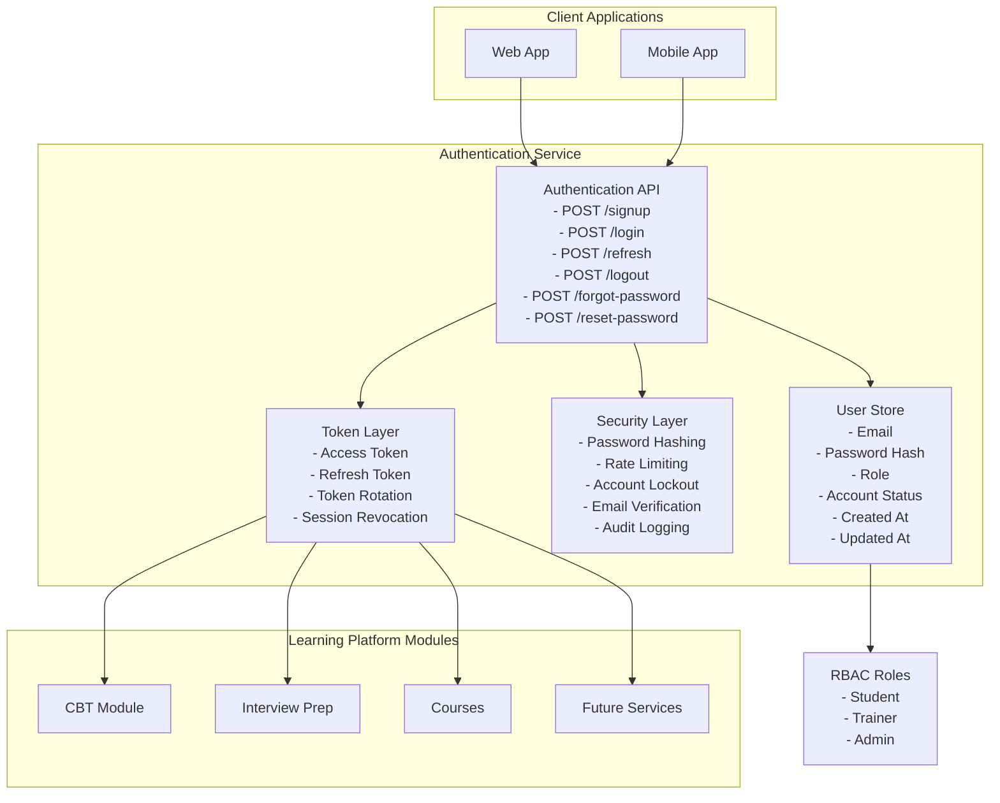

# Authentication Service Architecture

```mermaid
flowchart TB

    %% =========================
    %% Client Layer
    %% =========================
    subgraph CLIENT["Client Applications"]
        WEB["Web App"]
        MOBILE["Mobile App"]
    end

    %% =========================
    %% Authentication Service
    %% =========================
    subgraph AUTH["Authentication Service"]

        API["Authentication API
        - POST /signup
        - POST /login
        - POST /refresh
        - POST /logout
        - POST /forgot-password
        - POST /reset-password"]

        TOKEN["Token Layer
        - Access Token
        - Refresh Token
        - Token Rotation
        - Session Revocation"]

        SECURITY["Security Layer
        - Password Hashing
        - Rate Limiting
        - Account Lockout
        - Email Verification
        - Audit Logging"]

        USERSTORE["User Store
        - Email
        - Password Hash
        - Role
        - Account Status
        - Created At
        - Updated At"]

    end

    %% =========================
    %% Platform Modules
    %% =========================
    subgraph MODULES["Learning Platform Modules"]

        CBT["CBT Module"]
        INTERVIEW["Interview Prep"]
        COURSES["Courses"]
        FUTURE["Future Services"]

    end

    %% =========================
    %% Authentication Flow
    %% =========================
    WEB --> API
    MOBILE --> API

    API --> SECURITY
    API --> USERSTORE
    API --> TOKEN

    TOKEN --> CBT
    TOKEN --> INTERVIEW
    TOKEN --> COURSES
    TOKEN --> FUTURE

    %% =========================
    %% Role Based Access
    %% =========================
    ROLES["RBAC Roles
    - Student
    - Trainer
    - Admin"]

    USERSTORE --> ROLES

```
