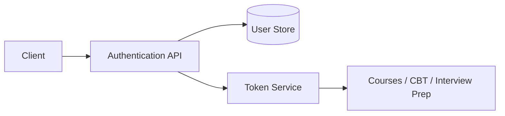

# System Design

## How would you design an authentication service?
Level: Intermediate

### Answer
- Start by clarifying users, roles, login methods, expected traffic, and security requirements.
- Store users with password hashes, role information, account status, and audit timestamps.
- Issue short-lived access tokens and longer-lived refresh tokens.
- Protect login and reset-password endpoints with rate limiting.
- Support logout by revoking refresh tokens or server-side sessions.
- Add email verification, password reset flow, and audit logs for sensitive actions.

## How would you design an API gateway?
Level: Intermediate

### Answer
- Place the gateway between clients and backend services.
- Use it for routing, authentication checks, request limits, logging, and common headers.
- Keep business logic inside backend services, not inside the gateway.
- Add health checks and observability so failures are easy to detect.

## How would you design a notification service?
Level: Intermediate

### Answer
- Accept notification requests through an API.
- Store notification jobs with status, recipient, channel, and retry metadata.
- Use a queue so email, SMS, and push workers can process jobs asynchronously.
- Add retry rules, dead-letter queues, and delivery logs.
